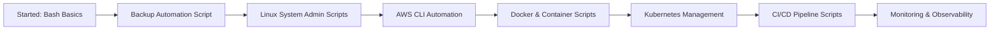

# 🚀 Aspiring Cloud & DevOps Engineer | Bash Scripting Repository

<h1 align="center" style="font-weight:bold;">
  ☁️ Cloud & DevOps Learning Journey - Bash Automation Hub
</h1>

<div align="center">
  
</div>

<div align="center">
  <br />
  
  
  
  
  
  
  
  
  
</div>

---

## 👋 About Me & This Repository

**Hello! I'm Jeyamurugan Nadar** - an **aspiring Cloud & DevOps Engineer** currently building my skills in:

- ☁️ **AWS Cloud Services** (EC2, S3, IAM, VPC)
- 🐧 **Linux Administration & Bash Scripting**
- 🐳 **Docker & Containerization**
- ⚙️ **Kubernetes Orchestration**
- 🔄 **CI/CD Pipelines** (GitLab CI)
- 📊 **Monitoring & Observability** (Prometheus, Grafana)
- 📝 **Git & GitHub/GitLab** workflows
- 🤖 **Infrastructure as Code & Automation**

**This repository** documents my **hands-on learning journey** in Bash scripting and DevOps automation. Each script here is created as I learn new concepts and solve real-world DevOps problems.

---

## 📁 Repository Structure - Learning Progress

```
bash-scripting/
│
├── 📂 backups/                           # First project - Backup automation
│   ├── backup_with_rotation.sh          # My first production-grade script
│   ├── README.md                        # Detailed documentation
│   └── cron_examples.txt               # Scheduling examples
│
├── 📂 aws/                              # Coming soon - AWS automation
│   └── (AWS CLI scripts for EC2, S3, IAM)
│
├── 📂 docker/                           # Coming soon - Docker automation
│   └── (Container management scripts)
│
├── 📂 kubernetes/                       # Coming soon - K8s automation
│   └── (K8s cluster management scripts)
│
├── 📂 monitoring/                       # Coming soon - Monitoring scripts
│   └── (Prometheus, Grafana, alerting)
│
├── 📂 ci-cd/                            # Coming soon - CI/CD automation
│   └── (GitLab CI, Jenkins automation)
│
└── 📂 linux-system-admin/               # Coming soon - Linux admin scripts
    └── (User management, security, updates)
```

**Note:** Currently, I've started with **backup automation** scripts. As I progress in my learning, I'll add scripts for each technology stack in dedicated folders.

---

## 🎯 Current Learning Focus & Roadmap

### ✅ **Currently Working On:**
- 🔄 **Backup & Rotation Automation** (Completed first script)
- 📚 **Advanced Bash Scripting** patterns
- 🐧 **Linux System Administration** tasks

### 📅 **Next Learning Milestones:**

| Technology | Status | Planned Scripts |
|------------|--------|-----------------|
| **AWS CLI Automation** | Coming Soon | EC2 management, S3 backups, IAM user management |
| **Docker** | Coming Soon | Container cleanup, image management, Docker Compose helpers |
| **Kubernetes** | Coming Soon | Pod management, resource monitoring, deployment automation |
| **Git & GitHub** | Coming Soon | Auto-commit, repo management, backup scripts |
| **GitLab CI/CD** | Coming Soon | Pipeline helpers, auto-deployment scripts |
| **Prometheus** | Coming Soon | Metric collection, alert automation |
| **Grafana** | Coming Soon | Dashboard automation, reporting |

---

## 🚀 My First Script - Backup with Rotation

### 🔧 **Script:** `backups/backup_with_rotation.sh`

**What I Learned:**
- ✅ Creating timestamped backups
- ✅ Implementing rotation logic (keep last N backups)
- ✅ Error handling and input validation
- ✅ Making scripts cron-job ready
- ✅ Writing clean, maintainable Bash code

**Usage Example:**
```bash
cd backups
chmod +x backup_with_rotation.sh
./backup_with_rotation.sh /path/to/your/directory
```

---

## 🛠️ Technologies I'm Learning & Practicing

<div align="center">
  <table>
    <tr>
      <td align="center">
        
        <br><strong>AWS</strong>
        <br>EC2, S3, IAM, VPC
      </td>
      <td align="center">
        
        <br><strong>Bash</strong>
        <br>Scripting & Automation
      </td>
      <td align="center">
        
        <br><strong>Docker</strong>
        <br>Containerization
      </td>
      <td align="center">
        
        <br><strong>K8s</strong>
        <br>Orchestration
      </td>
    </tr>
    <tr>
      <td align="center">
        
        <br><strong>GitLab</strong>
        <br>CI/CD Pipelines
      </td>
      <td align="center">
        
        <br><strong>Prometheus</strong>
        <br>Monitoring
      </td>
      <td align="center">
        
        <br><strong>Grafana</strong>
        <br>Visualization
      </td>
      <td align="center">
        
        <br><strong>Linux</strong>
        <br>System Administration
      </td>
    </tr>
  </table>
</div>

---

## 📚 Learning Resources I'm Using

- **AWS Skill Builder** - Cloud fundamentals & services
- **Linux Academy** - Bash scripting & system administration
- **KodeKloud** - Docker & Kubernetes hands-on labs
- **GitLab Documentation** - CI/CD pipeline creation
- **Prometheus & Grafana** - Official documentation
- **YouTube Channels** - TechWorld with Nana, FreeCodeCamp

---

## 🤝 How to Navigate This Repository

1. **Start with `backups/`** - My first complete project
2. Check **commit history** to see my learning progression
3. Each new folder = New technology I'm learning
4. Scripts include comments explaining what I learned

---

## 📈 My Learning Progress Timeline



---

## 💡 Why This Repository Exists

This is my **public learning journal** where I:
- 📝 Document my DevOps learning journey
- 🔧 Build practical, reusable scripts
- 🎯 Create portfolio projects for job applications
- 🤝 Share knowledge with fellow learners
- 📚 Track my progress over time

---

## 🎓 For Fellow Aspiring DevOps Engineers

If you're also learning:
1. Start with **one technology at a time**
2. Build **small, working scripts first**
3. Document **what you learn**
4. Create **real-world projects**
5. **Share your journey** - it helps others!

---

## 📞 Connect & Collaborate

**Jeyamurugan Nadar**  
*Aspiring Cloud & DevOps Engineer*

<p align="left">
  <a href="https://github.com/nadarmurugan" target="_blank">
    
  </a>
  <a href="https://linkedin.com/in/murugannadar/" target="_blank">
    
  </a>
  <a href="mailto:murugannadar077@gmail.com">
    
  </a>
</p>

---

<div align="center">
  
  **"The journey of a thousand miles begins with a single script."**

  

  ⭐ **Star this repo** to follow my journey from beginner to DevOps Engineer!
</div>
