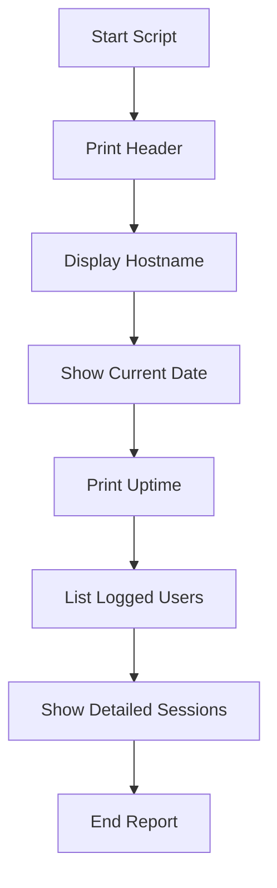

<h1 align="center">📊 System Status Checker Script</h1>

<h1 align="center" style="font-weight:bold;">
  🖥️ Linux System Status & Uptime Monitor
</h1>

<div align="center">
  
</div>

<div align="center">
  <br />
  
  
  
  
  
</div>

---

## 📋 Project Overview
A clean, efficient Bash script that provides a comprehensive snapshot of your Linux system's current status. Perfect for system administrators and DevOps engineers to quickly check server health, uptime, and active user sessions.

### ⚡ Key Features
* **System Uptime:** Shows how long the system has been running
* **Active Users:** Lists all logged-in users and their sessions
* **Detailed Sessions:** Provides comprehensive user activity information
* **Professional Formatting:** Clean, organized output with timestamps
* **Zero Dependencies:** Uses built-in Linux commands only

---

## 👤 Author
**Jeyamurugan Nadar** *Aspiring DevOps & Cloud Engineer*

<p align="left">
  <a href="https://github.com/nadarmurugan" target="_blank">
    
  </a>
  <a href="https://linkedin.com/in/murugannadar/" target="_blank">
    
  </a>
  <a href="mailto:murugannadar077@gmail.com">
    
  </a>
</p>

---

## 🎯 Why This Script?

<div align="center">
  
</div>

### The Problem
When managing multiple servers, you need a quick way to:
- Check if a server rebooted recently
- See who's currently logged in
- Monitor system stability
- Document system status for audits

### The Solution
This one-script solution gives you all critical system information in a single, clean output. No SSH multiple commands, no complex tools - just pure Bash efficiency.

---

## 📊 Script Output Flow



---

## 🚀 Quick Start

### **1. Download or Create the Script**
```bash
# Create the script file
nano system_status.sh
```

### **2. Copy the Script Content**
```bash
#!/bin/bash
# Simple Uptime & Logged-in Users Checker
# Author: Jeyamurugan Nadar
# Email: murugannadar077@gmail.com

echo "=============================="
echo "System Status Report"
echo "Hostname: $(hostname)"
echo "Date    : $(date)"
echo "=============================="

echo
echo "Uptime:"
uptime

echo
echo "Logged-in users:"
who

echo
echo "Detailed sessions:"
w
```

### **3. Make it Executable**
```bash
chmod +x system_status.sh
```

### **4. Run the Script**
```bash
./system_status.sh
```

---

## 📜 The Complete Script

```bash
#!/bin/bash
# Simple Uptime & Logged-in Users Checker
# Author: Jeyamurugan Nadar
# Email: murugannadar077@gmail.com

echo "=============================="
echo "System Status Report"
echo "Hostname: $(hostname)"
echo "Date    : $(date)"
echo "=============================="

echo
echo "Uptime:"
uptime

echo
echo "Logged-in users:"
who

echo
echo "Detailed sessions:"
w
```

---

## 🧠 Interview Ready Statement

> **Memorize This:** "I use a Bash script with `hostname`, `date`, `uptime`, `who`, and `w` commands to generate comprehensive system status reports for server monitoring."

---

## ⚙️ How It Works - Line by Line

### **1. Shebang Declaration**
```bash
#!/bin/bash
```
- Standard shebang for Bash scripts
- Ensures script runs with Bash shell

### **2. Script Metadata**
```bash
# Simple Uptime & Logged-in Users Checker
# Author: Jeyamurugan Nadar
# Email: murugannadar077@gmail.com
```
- Clear documentation
- Author information for attribution

### **3. Report Header**
```bash
echo "=============================="
echo "System Status Report"
echo "Hostname: $(hostname)"
echo "Date    : $(date)"
echo "=============================="
```
- Creates professional-looking header
- `$(hostname)` - Dynamically inserts system hostname
- `$(date)` - Shows current date and time
- Visual separators for readability

### **4. Uptime Section**
```bash
echo
echo "Uptime:"
uptime
```
- Empty `echo` for spacing
- `uptime` command shows:
  - Current time
  - System uptime
  - Number of users
  - Load averages (1, 5, 15 minutes)

### **5. Logged-in Users**
```bash
echo
echo "Logged-in users:"
who
```
- `who` command displays:
  - Username
  - Terminal
  - Login time
  - Remote host (if SSH)

### **6. Detailed Sessions**
```bash
echo
echo "Detailed sessions:"
w
```
- `w` command provides:
  - Current user
  - Terminal
  - Remote host
  - Login time
  - Idle time
  - JCPU/PCPU time
  - Current process

---

## 📊 Understanding the Output

### **Sample Output:**
```
==============================
System Status Report
Hostname: server1
Date    : Mon Feb  6 10:30:00 UTC 2024
==============================

Uptime:
 10:30:00 up 45 days,  3:15,  2 users,  load average: 0.08, 0.03, 0.01

Logged-in users:
john     pts/0        2024-02-06 09:15 (192.168.1.100)
sarah    pts/1        2024-02-06 10:00 (192.168.1.101)

Detailed sessions:
 10:30:00 up 45 days,  3:15,  2 users,  load average: 0.08, 0.03, 0.01
USER     TTY      FROM             LOGIN@   IDLE   JCPU   PCPU WHAT
john     pts/0    192.168.1.100    09:15    1:15   0.05s  0.01s sshd: john
sarah    pts/1    192.168.1.101    10:00    0.00s  0.10s  0.02s vim system_status.sh
```

### **Key Information Extracted:**
1. **System Stability:** 45 days uptime indicates stable server
2. **Current Load:** Low load averages (0.08, 0.03, 0.01)
3. **Active Sessions:** 2 users logged in
4. **User Activity:** Sarah is actively editing a file
5. **Connection Sources:** Both users connected via SSH

---

## 🔧 Automation & Scheduling

### **Schedule Regular Status Checks**
```bash
# Add to crontab for daily report at 9 AM
crontab -e
```
Add:
```bash
0 9 * * * /path/to/system_status.sh >> /var/log/system_status_daily.log
```

### **Email Daily Report**
```bash
# Create wrapper script for email
nano daily_status.sh
```
Add:
```bash
#!/bin/bash
/path/to/system_status.sh | mail -s "Daily System Status - $(date)" murugannadar077@gmail.com
```

### **Multiple Scheduling Options**
```bash
# Every hour during business hours
0 9-17 * * 1-5 /path/to/system_status.sh >> /var/log/hourly_status.log

# Every 30 minutes
*/30 * * * * /path/to/system_status.sh >> /var/log/30min_status.log

# Weekly summary every Monday
0 8 * * 1 /path/to/system_status.sh >> /var/log/weekly_status.log
```

---

## 🎨 Customization Options

### **Add System Load Alert**
```bash
#!/bin/bash
# Enhanced version with load alert

echo "=============================="
echo "System Status Report"
echo "Hostname: $(hostname)"
echo "Date    : $(date)"
echo "=============================="

echo
echo "Uptime:"
uptime

# Check load average
load=$(uptime | awk -F'load average:' '{print $2}' | awk '{print $1}' | tr -d ',')
if (( $(echo "$load > 1.0" | bc -l) )); then
    echo "⚠️  HIGH LOAD DETECTED: $load"
fi

echo
echo "Logged-in users:"
who

echo
echo "Detailed sessions:"
w
```

### **Add Disk Space Check**
```bash
#!/bin/bash
# With disk space information

echo "=============================="
echo "System Status Report"
echo "Hostname: $(hostname)"
echo "Date    : $(date)"
echo "=============================="

echo
echo "Uptime:"
uptime

echo
echo "Disk Usage:"
df -h /

echo
echo "Logged-in users:"
who

echo
echo "Detailed sessions:"
w
```

### **Add Memory Information**
```bash
#!/bin/bash
# With memory usage

echo "=============================="
echo "System Status Report"
echo "Hostname: $(hostname)"
echo "Date    : $(date)"
echo "=============================="

echo
echo "Uptime:"
uptime

echo
echo "Memory Usage:"
free -h

echo
echo "Logged-in users:"
who

echo
echo "Detailed sessions:"
w
```

### **Colorful Output**
```bash
#!/bin/bash
# Colorful version

RED='\033[0;31m'
GREEN='\033[0;32m'
YELLOW='\033[1;33m'
NC='\033[0m' # No Color

echo -e "${GREEN}==============================${NC}"
echo -e "${YELLOW}System Status Report${NC}"
echo "Hostname: $(hostname)"
echo "Date    : $(date)"
echo -e "${GREEN}==============================${NC}"

echo
echo -e "${YELLOW}Uptime:${NC}"
uptime

echo
echo -e "${YELLOW}Logged-in users:${NC}"
who

echo
echo -e "${YELLOW}Detailed sessions:${NC}"
w
```

---

## 🐧 System Requirements

| Component | Requirement | Check Command |
|-----------|-------------|---------------|
| OS | Linux/Unix | `uname -a` |
| Bash | Version 3.2+ | `bash --version` |
| Core Utilities | Standard GNU coreutils | Built-in |
| Privileges | User-level access | `id` |

---

## 🔍 Troubleshooting Guide

### **Common Issues & Solutions**

| Problem | Symptom | Solution |
|---------|---------|----------|
| Permission denied | Script won't run | `chmod +x system_status.sh` |
| Command not found | `who` or `w` missing | Install coreutils (extremely rare) |
| No output | Script runs but shows nothing | Check if commands exist: `which uptime` |
| Incorrect date format | Date displays strangely | Check system locale: `locale` |
| Script not executable | `bash: ./system_status.sh: Permission denied` | `chmod +x system_status.sh` |

### **Debug Mode**
Run with trace to see execution:
```bash
bash -x system_status.sh
```

### **Test Individual Commands**
```bash
# Test each command separately
hostname
date
uptime
who
w
```

---

## 🏗️ Production Deployment

### **For System Administrators**
1. Place in standard location:
```bash
sudo cp system_status.sh /usr/local/bin/
sudo chmod +x /usr/local/bin/system_status.sh
```

2. Create alias for easy access:
```bash
echo "alias status='/usr/local/bin/system_status.sh'" >> ~/.bashrc
source ~/.bashrc
```

3. Now use simply:
```bash
status
```

### **For Multiple Servers**
```bash
#!/bin/bash
# Multi-server checker
servers=("server1" "server2" "server3")

for server in "${servers[@]}"; do
    echo "=== Checking $server ==="
    ssh "$server" "$(cat system_status.sh)"
    echo
done
```

### **Docker Container Version**
```dockerfile
# Dockerfile for containerized version
FROM alpine:latest

COPY system_status.sh /usr/local/bin/
RUN chmod +x /usr/local/bin/system_status.sh

ENTRYPOINT ["/usr/local/bin/system_status.sh"]
```

---

## 📈 Advanced Usage Examples

### **Log Rotation with Timestamps**
```bash
#!/bin/bash
# Status check with logging
LOG_DIR="/var/log/system-status"
LOG_FILE="$LOG_DIR/status_$(date +%Y%m%d_%H%M%S).log"

mkdir -p "$LOG_DIR"
{
    echo "=============================="
    echo "System Status Report"
    echo "Hostname: $(hostname)"
    echo "Date    : $(date)"
    echo "=============================="
    echo
    echo "Uptime:"
    uptime
    echo
    echo "Logged-in users:"
    who
    echo
    echo "Detailed sessions:"
    w
} > "$LOG_FILE"

echo "Report saved to: $LOG_FILE"
```

### **HTML Report Generation**
```bash
#!/bin/bash
# Generate HTML report
HTML_FILE="/var/www/html/status_$(date +%Y%m%d).html"

cat > "$HTML_FILE" << EOF
<!DOCTYPE html>
<html>
<head>
    <title>System Status Report</title>
    <style>
        body { font-family: Arial, sans-serif; margin: 40px; }
        .header { background: #f0f0f0; padding: 20px; border-radius: 5px; }
        .section { margin: 20px 0; }
        pre { background: #f8f8f8; padding: 10px; border-left: 3px solid #0073e6; }
    </style>
</head>
<body>
    <div class="header">
        <h1>System Status Report</h1>
        <p><strong>Hostname:</strong> $(hostname)</p>
        <p><strong>Date:</strong> $(date)</p>
    </div>
    
    <div class="section">
        <h2>Uptime</h2>
        <pre>$(uptime)</pre>
    </div>
    
    <div class="section">
        <h2>Logged-in Users</h2>
        <pre>$(who)</pre>
    </div>
    
    <div class="section">
        <h2>Detailed Sessions</h2>
        <pre>$(w)</pre>
    </div>
</body>
</html>
EOF

echo "HTML report generated: $HTML_FILE"
```

### **JSON Output for APIs**
```bash
#!/bin/bash
# Generate JSON output
{
    echo '{'
    echo '  "hostname": "'$(hostname)'",'
    echo '  "timestamp": "'$(date -Iseconds)'",'
    echo '  "uptime": "'$(uptime -p | sed 's/up //')'",'
    echo '  "users": ['
    who | while read line; do
        user=$(echo $line | awk '{print $1}')
        tty=$(echo $line | awk '{print $2}')
        from=$(echo $line | awk '{print $3}')
        time=$(echo $line | awk '{print $4}')
        echo '    {'
        echo '      "username": "'$user'",'
        echo '      "terminal": "'$tty'",'
        echo '      "from": "'$from'",'
        echo '      "login_time": "'$time'"'
        echo '    },'
    done | sed '$ s/,$//'
    echo '  ]'
    echo '}'
}
```

---

## 🎯 DevOps Integration

### **With Ansible**
```yaml
# ansible playbook to run on multiple servers
- name: Gather System Status
  hosts: all
  tasks:
    - name: Run system status check
      shell: |
        echo "=== {{ inventory_hostname }} ==="
        ./system_status.sh
      register: status_output
    
    - name: Display status
      debug:
        var: status_output.stdout_lines
```

### **With Prometheus/Grafana**
```bash
#!/bin/bash
# Export metrics for Prometheus
echo '# HELP system_uptime_seconds System uptime in seconds'
echo '# TYPE system_uptime_seconds gauge'
uptime -s | xargs date +%s -d | awk -v now=$(date +%s) '{print "system_uptime_seconds " now - $1}'

echo '# HELP system_users_total Number of logged in users'
echo '# TYPE system_users_total gauge'
who | wc -l | awk '{print "system_users_total " $1}'
```

### **With Slack Notifications**
```bash
#!/bin/bash
# Send to Slack webhook
WEBHOOK_URL="https://hooks.slack.com/services/YOUR/WEBHOOK/URL"

STATUS_REPORT=$(./system_status.sh | sed ':a;N;$!ba;s/\n/\\n/g')

curl -X POST -H 'Content-type: application/json' \
  --data "{\"text\":\"📊 *System Status Report*\n\`\`\`$STATUS_REPORT\`\`\`\"}" \
  "$WEBHOOK_URL"
```

---

## 📚 Learning Resources

### **Commands Used**
- `hostname` - [Manual Page](https://man7.org/linux/man-pages/man1/hostname.1.html)
- `date` - [Manual Page](https://man7.org/linux/man-pages/man1/date.1.html)
- `uptime` - [Manual Page](https://man7.org/linux/man-pages/man1/uptime.1.html)
- `who` - [Manual Page](https://man7.org/linux/man-pages/man1/who.1.html)
- `w` - [Manual Page](https://man7.org/linux/man-pages/man1/w.1.html)

### **Related Concepts**
- Linux System Administration
- Server Monitoring
- User Management
- Shell Scripting
- DevOps Automation

---

## 🤝 Contributing

Want to improve this script?
1. Fork the repository
2. Create a feature branch
3. Make your improvements
4. Submit a pull request

**Suggested Improvements:**
- Add network connection information
- Include service status checks
- Add hardware temperature monitoring
- Create dashboard integration

---

## ⚖️ License

MIT License - Free to use, modify, and distribute. Attribution appreciated.

---

## 🌟 Support

If this script helps you:
- ⭐ Star the GitHub repository
- 🔗 Share with your team
- 🐛 Report any issues
- 💡 Suggest new features

---

## 📞 Contact & Support

**Jeyamurugan Nadar**  
*Aspiring DevOps & Cloud Engineer*

<p align="left">
  <a href="https://github.com/nadarmurugan" target="_blank">
    
  </a>
  <a href="https://linkedin.com/in/murugannadar/" target="_blank">
    
  </a>
  <a href="mailto:murugannadar077@gmail.com">
    
  </a>
</p>

<div align="center">
  
</div>

---

## 🚀 Quick Reference Card

```bash
# One-liner for quick status check
bash -c 'echo "=== $(hostname) === $(date) ==="; uptime; echo; echo "Users:"; who; echo; echo "Sessions:"; w'
```

**Pro Tip:** Add `alias sysstat='./system_status.sh'` to your `.bashrc` for instant access!

---

*Last Updated: $(date)*  
*Stay Informed, Stay Ahead! 🎯*
