<h1 align="center">🔥 Temp File Annihilator - Ultimate System Cleaner</h1>

<div align="center">


**"When storage anxiety strikes, this script fights back!"**

*Created by: **Jeyamurugan Nadar** | Aspiring DevOps & CloudOps Engineer*  
📧 *murugannadar077@gmail.com*  
🔗 *https://github.com/nadarmurugan*

</div>

---

## 📋 Table of Contents

```mermaid
graph TD
    A[📋 Table of Contents] --> B[✨ Features]
    A --> C[🎯 What It Does]
    A --> D[🚨 Warning]
    A --> E[⚡ Quick Start]
    A --> F[📜 Script]
    A --> G[🏗️ Architecture]
    A --> H[⏰ Automation]
    A --> I[🛡️ Safe Alternative]
    A --> J[📊 Monitoring]
    A --> K[🔧 DevOps Integration]
    A --> L[☁️ CloudOps Setup]
    A --> M[❓ FAQ]
    A --> N[📝 License]
    
    style A fill:#3498db,color:#fff
    style B fill:#2ecc71
    style C fill:#e74c3c
    style D fill:#f39c12
```



---

## ✨ Features

```mermaid
graph LR
    A[✨ Features] --> B[🚀 Instant Cleanup]
    A --> C[⏰ Automated]
    A --> D[📊 Space Recovery]
    A --> E[🛡️ Safe Mode]
    A --> F[📝 Logging]
    A --> G[🔧 DevOps Ready]
    A --> H[☁️ CloudOps Compatible]
    
    style A fill:#9b59b6,color:#fff
    style B fill:#3498db
    style C fill:#2ecc71
    style D fill:#e74c3c
    style E fill:#f1c40f
    style F fill:#1abc9c
    style G fill:#34495e
    style H fill:#e67e22
```

<div align="center">



| Feature | Description | DevOps Ready | CloudOps Ready |
|---------|-------------|--------------|----------------|
| 🚀 **Instant Cleanup** | Removes all temp files in seconds | ✅ Yes | ✅ Yes |
| ⏰ **Automated** | Schedule with cron/CI/CD | ✅ Yes | ✅ Yes |
| 📊 **Space Recovery** | Reclaims gigabytes of storage | ✅ Yes | ✅ Yes |
| 🛡️ **Safe Mode** | Optional age-based deletion | ✅ Yes | ✅ Yes |
| 📝 **Logging** | Detailed logs for monitoring | ✅ Yes | ✅ Yes |
| 🔧 **DevOps Integration** | Works with Jenkins/GitLab CI | ✅ Yes | ✅ Yes |
| ☁️ **CloudOps Support** | AWS/Google Cloud/Azure ready | ✅ Yes | ✅ Yes |

</div>

---

## 🎯 What It Does

### System Architecture Flow:

```mermaid
graph TB
    subgraph "🔍 Pre-Cleanup State"
        A[System Storage<br/>📊 80-95% Full] --> B[Temp Files Accumulation]
        B --> C[/tmp/*<br/>📁 2.4 GB/]
        B --> D[~/.cache/*<br/>📁 1.8 GB/]
    end
    
    subgraph "⚡ Cleanup Process"
        E[Cleanup Trigger] --> F{Mode Selection}
        F -->|Aggressive| G[rm -rf /tmp/*]
        F -->|Safe| H[find /tmp -mtime +7 -delete]
        G --> I[rm -rf ~/.cache/*]
        H --> J[find ~/.cache -mtime +30 -delete]
    end
    
    subgraph "📈 Post-Cleanup State"
        K[System Storage<br/>📊 60-70% Full] --> L[Clean Directories]
        L --> M[/tmp/*<br/>📁 0.0 GB/]
        L --> N[~/.cache/*<br/>📁 0.0 GB/]
    end
    
    C --> E
    D --> E
    I --> K
    J --> K
    
    style A fill:#e74c3c,color:#fff
    style K fill:#2ecc71,color:#fff
    style F fill:#f39c12
```



### Target Areas:
```bash
📍 /tmp/*          # System temporary files
📍 ~/.cache/*      # User application caches
```

### Space Recovery Example:
```bash
📊 BEFORE:
├── /tmp:    2.4 GB
└── ~/.cache: 1.8 GB
Total: 4.2 GB

🎯 AFTER:
├── /tmp:    0.0 GB
└── ~/.cache: 0.0 GB
✅ Recovered: 4.2 GB!
```

---

## 🏗️ System Architecture

### DevOps Pipeline Integration:

```mermaid
graph LR
    subgraph "🔄 CI/CD Pipeline"
        A[Git Push] --> B[Jenkins/GitLab Trigger]
        B --> C[Build Stage]
        C --> D[Test Stage]
        D --> E[Temp Cleanup Stage]
        E --> F[Deploy Stage]
        F --> G[Production]
    end
    
    subgraph "📦 Containerized Version"
        H[Dockerfile] --> I[Build Image]
        I --> J[Push to Registry]
        J --> K[Kubernetes CronJob]
        K --> L[Scheduled Cleanup]
    end
    
    E --> M[📊 Performance Metrics]
    L --> M
    M --> N[📈 Grafana Dashboard]
    
    style A fill:#3498db,color:#fff
    style G fill:#2ecc71,color:#fff
    style N fill:#9b59b6,color:#fff
```



### CloudOps Multi-Cloud Architecture:

```mermaid
graph TB
    subgraph "☁️ Multi-Cloud Deployment"
        subgraph "AWS"
            A1[EC2 Instance] --> A2[CloudWatch Events]
            A2 --> A3[Lambda Function]
        end
        
        subgraph "Google Cloud"
            B1[Compute Engine] --> B2[Cloud Scheduler]
            B2 --> B3[Cloud Functions]
        end
        
        subgraph "Azure"
            C1[VM] --> C2[Logic Apps]
            C2 --> C3[Azure Functions]
        end
    end
    
    A3 --> D[Central Monitoring]
    B3 --> D
    C3 --> D
    
    D --> E[📊 Cloud Monitoring]
    D --> F[📈 Log Analytics]
    D --> G[🔔 Alerting System]
    
    style A1 fill:#FF9900
    style B1 fill:#4285F4
    style C1 fill:#0078D7
    style E fill:#2ecc71
```



---

## 🚨 Warning

<div align="center">


</div>

### Risk Assessment Matrix:

```mermaid
graph TD
    A[Risk Assessment] --> B{Environment Type}
    B -->|Production| C[🔴 HIGH RISK<br/>Schedule at 2 AM]
    B -->|Staging| D[🟡 MEDIUM RISK<br/>Test First]
    B -->|Development| E[🟢 LOW RISK<br/>Can run anytime]
    
    C --> F[Critical Data Backup Required]
    D --> G[Partial Backup Recommended]
    E --> H[Optional Backup]
    
    F --> I[🛡️ Safety Protocols]
    G --> I
    H --> I
    
    I --> J[✅ Ready for Cleanup]
    
    style C fill:#e74c3c,color:#fff
    style D fill:#f39c12,color:#000
    style E fill:#2ecc71,color:#fff
    style J fill:#3498db,color:#fff
```



### ⚠️ **This script will delete:**
- All files in `/tmp/` (system temporary files)
- All files in `~/.cache/` (user cache files)
- **No confirmation asked!**
- **No recovery possible!**

### 🔴 **Potential Issues:**
- Applications may run slower on next launch
- Some apps might crash or lose session data
- Package managers need to re-download metadata
- Browser caches will be cleared

---

## ⚡ Quick Start

### Installation Flow:


### 1. Download & Install:
```bash
# Download the script
wget -O clean_temp.sh https://raw.githubusercontent.com/yourusername/temp-cleaner/main/clean_temp.sh

# Make it executable
chmod +x clean_temp.sh
```

### 2. Test First (Dry Run):
```bash
# DevOps style testing
echo "=== DRY RUN TEST ==="
echo "Files in /tmp: $(find /tmp -type f 2>/dev/null | wc -l)"
echo "Files in cache: $(find ~/.cache -type f 2>/dev/null | wc -l)"
echo "Estimated space: $(du -sh /tmp ~/.cache 2>/dev/null | tail -1)"
```

### 3. Run the Script:
```bash
# Execute with monitoring
./clean_temp.sh | tee cleanup_$(date +%Y%m%d).log
```

---

## 📜 Script Architecture

### Main Script Flowchart:


### **Main Script (Aggressive Cleaner):**
```bash
#!/bin/bash
# clean_temp.sh - Aggressive temporary file cleaner
# Author: Your Name - Aspiring DevOps & CloudOps Engineer
# Email: your.email@example.com

echo "🔥 INITIATING TEMP FILE CLEANUP..."
echo "=================================="

# Store before state
BEFORE_TMP=$(find /tmp -type f 2>/dev/null | wc -l)
BEFORE_CACHE=$(find ~/.cache -type f 2>/dev/null | wc -l)

echo "📊 BEFORE:"
echo "  Files in /tmp:    $BEFORE_TMP"
echo "  Files in ~/.cache: $BEFORE_CACHE"
echo ""

# The cleanup (AGGRESSIVE MODE)
echo "🧹 CLEANING..."
rm -rf /tmp/* 2>/dev/null
rm -rf ~/.cache/* 2>/dev/null

# Store after state
AFTER_TMP=$(find /tmp -type f 2>/dev/null | wc -l)
AFTER_CACHE=$(find ~/.cache -type f 2>/dev/null | wc -l)

echo ""
echo "📊 AFTER:"
echo "  Files in /tmp:    $AFTER_TMP"
echo "  Files in ~/.cache: $AFTER_CACHE"
echo ""
echo "✅ CLEANUP COMPLETE!"
echo "🎉 Files removed: $((BEFORE_TMP + BEFORE_CACHE - AFTER_TMP - AFTER_CACHE))"
```

---

## 🔧 DevOps Integration

### Jenkins Pipeline Example:

```groovy
pipeline {
    agent any
    
    stages {
        stage('Pre-Cleanup') {
            steps {
                script {
                    echo "📊 Pre-cleanup disk usage:"
                    sh 'df -h /'
                }
            }
        }
        
        stage('Temp Cleanup') {
            steps {
                script {
                    echo "🧹 Running temp cleanup..."
                    sh '''
                        ./clean_temp.sh
                        echo "Cleanup completed at $(date)" > cleanup_report.txt
                    '''
                }
            }
        }
        
        stage('Post-Cleanup') {
            steps {
                script {
                    echo "📈 Post-cleanup disk usage:"
                    sh 'df -h /'
                    archiveArtifacts artifacts: 'cleanup_report.txt', fingerprint: true
                }
            }
        }
    }
    
    post {
        always {
            emailext (
                subject: "Temp Cleanup Pipeline - ${currentBuild.result}",
                body: "Build ${env.BUILD_NUMBER} completed with status: ${currentBuild.result}",
                to: 'your.email@example.com'
            )
        }
    }
}
```

### GitLab CI/CD Pipeline:

```yaml
stages:
  - test
  - cleanup
  - deploy

variables:
  CLEANUP_SCRIPT: "clean_temp.sh"

test_cleanup:
  stage: test
  script:
    - echo "Testing cleanup script..."
    - bash -n $CLEANUP_SCRIPT
    - echo "Script syntax is valid"
  artifacts:
    paths:
      - $CLEANUP_SCRIPT

run_cleanup:
  stage: cleanup
  script:
    - chmod +x $CLEANUP_SCRIPT
    - ./$CLEANUP_SCRIPT
    - echo "Space after cleanup:"
    - df -h /
  only:
    - schedules  # Run only on scheduled pipelines
  artifacts:
    reports:
      junit: cleanup_report.xml

deploy_cleanup:
  stage: deploy
  script:
    - echo "Setting up cron job..."
    - echo "0 2 * * * /opt/scripts/$CLEANUP_SCRIPT" | crontab -
  environment:
    name: production
    url: https://your-server.com
```

---

## ☁️ CloudOps Deployment

### AWS CloudFormation Template:

```yaml
AWSTemplateFormatVersion: '2010-09-09'
Description: 'Temp Cleanup Automation Stack for AWS'

Resources:
  CleanupLambdaRole:
    Type: 'AWS::IAM::Role'
    Properties:
      AssumeRolePolicyDocument:
        Version: '2012-10-17'
        Statement:
          - Effect: Allow
            Principal:
              Service: lambda.amazonaws.com
            Action: 'sts:AssumeRole'
      Policies:
        - PolicyName: LambdaExecutionPolicy
          PolicyDocument:
            Statement:
              - Effect: Allow
                Action:
                  - 'logs:CreateLogGroup'
                  - 'logs:CreateLogStream'
                  - 'logs:PutLogEvents'
                Resource: 'arn:aws:logs:*:*:*'

  TempCleanupLambda:
    Type: 'AWS::Lambda::Function'
    Properties:
      Handler: index.lambda_handler
      Role: !GetAtt CleanupLambdaRole.Arn
      Code:
        ZipFile: |
          import boto3
          import os
          import subprocess
          
          def lambda_handler(event, context):
              # SSH into EC2 instances and run cleanup
              ec2 = boto3.client('ec2')
              instances = ec2.describe_instances()
              
              for reservation in instances['Reservations']:
                  for instance in reservation['Instances']:
                      if instance['State']['Name'] == 'running':
                          # Run cleanup via SSM
                          ssm = boto3.client('ssm')
                          response = ssm.send_command(
                              InstanceIds=[instance['InstanceId']],
                              DocumentName="AWS-RunShellScript",
                              Parameters={
                                  'commands': [
                                      'rm -rf /tmp/*',
                                      'rm -rf ~/.cache/*',
                                      'echo "Cleanup completed at $(date)"'
                                  ]
                              }
                          )
              return {'statusCode': 200, 'body': 'Cleanup initiated'}
      Runtime: python3.8
      Timeout: 300

  CleanupSchedule:
    Type: 'AWS::Events::Rule'
    Properties:
      ScheduleExpression: 'cron(0 2 * * ? *)'  # Daily at 2 AM
      State: ENABLED
      Targets:
        - Arn: !GetAtt TempCleanupLambda.Arn
          Id: 'TempCleanupTarget'
```

### Kubernetes CronJob for CloudOps:

```yaml
apiVersion: batch/v1
kind: CronJob
metadata:
  name: temp-cleanup
  namespace: cloudops
  labels:
    app: temp-cleanup
    managed-by: cloudops-team
spec:
  schedule: "0 2 * * *"  # Daily at 2 AM UTC
  concurrencyPolicy: Forbid
  startingDeadlineSeconds: 300
  jobTemplate:
    spec:
      template:
        metadata:
          labels:
            app: temp-cleanup
        spec:
          serviceAccountName: cleanup-sa
          containers:
          - name: cleaner
            image: alpine:latest
            command:
            - /bin/sh
            - -c
            - |
              echo "Starting temp cleanup at $(date)"
              rm -rf /tmp/* 2>/dev/null || true
              rm -rf ~/.cache/* 2>/dev/null || true
              echo "Cleanup completed at $(date)"
            securityContext:
              runAsUser: 0  # Run as root
            volumeMounts:
            - name: tmp-volume
              mountPath: /tmp
            - name: cache-volume
              mountPath: /root/.cache
          restartPolicy: Never
          volumes:
          - name: tmp-volume
            hostPath:
              path: /tmp
              type: Directory
          - name: cache-volume
            hostPath:
              path: /root/.cache
              type: DirectoryOrCreate
```

---

## ⏰ Automation Flow

### Complete Automation Architecture:


### **Daily Cleanup (2 AM):**
```bash
# Edit crontab
crontab -e

# Add this line for daily cleanup at 2 AM
0 2 * * * /opt/scripts/clean_temp.sh >> /var/log/temp_clean.log 2>&1
```

### **Smart Cleanup (Only when disk > 80% full):**
```bash
# Smart cron job with CloudOps metrics
0 * * * * [ $(df / --output=pcent | tail -1 | tr -dc '0-9') -gt 80 ] && \
  /opt/scripts/clean_temp.sh && \
  aws cloudwatch put-metric-data --namespace "System/Cleanup" \
  --metric-name "SpaceRecovered" --value $(du -sh /tmp ~/.cache 2>/dev/null | tail -1 | cut -f1)
```

---

## 📊 Monitoring & Observability

### CloudOps Monitoring Dashboard:

```mermaid
graph LR
    subgraph "📡 Data Sources"
        A[System Logs] --> D[Monitoring]
        B[Application Metrics] --> D
        C[Cloud Metrics] --> D
    end
    
    subgraph "📊 Visualization"
        D --> E[Grafana Dashboards]
        E --> F[📈 Space Recovery Trends]
        E --> G[⏰ Cleanup Frequency]
        E --> H[🚨 Alert Status]
    end
    
    subgraph "🔔 Alerting"
        I[Prometheus Alerts] --> J[PagerDuty]
        K[CloudWatch Alarms] --> L[Slack Webhooks]
        M[Custom Scripts] --> N[Email Notifications]
    end
    
    F --> O[DevOps Team]
    H --> P[CloudOps Team]
    J --> Q[On-call Engineer]
    
    style O fill:#3498db,color:#fff
    style P fill:#e67e22,color:#fff
    style Q fill:#e74c3c,color:#fff
```



### Prometheus Metrics Example:
```yaml
# prometheus.yml
scrape_configs:
  - job_name: 'temp_cleanup'
    static_configs:
      - targets: ['localhost:9090']
    metrics_path: '/metrics'
    
  - job_name: 'node_exporter'
    static_configs:
      - targets: ['localhost:9100']
```

### Grafana Dashboard JSON:
```json
{
  "dashboard": {
    "title": "Temp Cleanup Monitoring",
    "panels": [
      {
        "title": "Disk Space Recovered",
        "type": "stat",
        "targets": [{
          "expr": "sum(temp_files_cleaned_total)"
        }]
      },
      {
        "title": "Cleanup Duration",
        "type": "graph",
        "targets": [{
          "expr": "rate(temp_cleanup_duration_seconds[5m])"
        }]
      }
    ]
  }
}
```

---

## 🛡️ Safe Alternative

### Risk-Based Cleanup Decision Tree:

```mermaid
graph TD
    A[Cleanup Request] --> B{Environment Type?}
    
    B -->|Production| C[🔴 HIGH RISK]
    B -->|Staging| D[🟡 MEDIUM RISK]
    B -->|Development| E[🟢 LOW RISK]
    
    C --> F{Business Hours?}
    F -->|Yes| G[⏸️ Postpone to 2 AM]
    F -->|No| H[🔄 Use Safe Mode]
    
    D --> I[🛡️ Use Safe Mode<br/>Delete files >7 days old]
    E --> J[⚡ Use Aggressive Mode<br/>Delete all temp files]
    
    G --> K[Schedule via Cron]
    H --> L[Execute with Backup]
    I --> M[Execute with Monitoring]
    J --> N[Execute Immediately]
    
    K --> O[📊 Generate Report]
    L --> O
    M --> O
    N --> O
    
    style C fill:#e74c3c,color:#fff
    style D fill:#f39c12,color:#000
    style E fill:#2ecc71,color:#fff
```



### **Safer Version (Age-based cleanup):**
```bash
#!/bin/bash
# safe_clean_temp.sh - DevOps Safe Cleanup Script
# Author: Your Name | Email: your.email@example.com

echo "🧹 SAFE TEMP CLEANUP STARTED..."
echo "================================"

# Clean files older than 7 days in /tmp
echo "Cleaning /tmp files older than 7 days..."
find /tmp -type f -mtime +7 -delete 2>/dev/null
echo "✅ /tmp cleanup complete"

# Clean files older than 30 days in cache
echo "Cleaning cache files older than 30 days..."
find ~/.cache -type f -mtime +30 -delete 2>/dev/null
echo "✅ Cache cleanup complete"

# CloudOps metrics collection
if command -v aws &> /dev/null; then
    SPACE_SAVED=$(du -sh /tmp ~/.cache 2>/dev/null | tail -1)
    aws cloudwatch put-metric-data \
        --namespace "System/Cleanup" \
        --metric-name "SpaceRecovered" \
        --value ${SPACE_SAVED%M} \
        --unit "Megabytes"
fi

echo ""
echo "🎉 Safe cleanup completed!"
```

---

## 🎯 When to Use (DevOps Perspective)

### Pipeline Integration Points:

```mermaid
graph LR
    subgraph "🔄 CI/CD Pipeline Stages"
        A[Code Commit] --> B[Build]
        B --> C[Test]
        C --> D{Deploy to?}
        D -->|Production| E[🛡️ Safe Cleanup]
        D -->|Staging| F[🛡️ Safe Cleanup]
        D -->|Development| G[⚡ Aggressive Cleanup]
        
        E --> H[Deploy]
        F --> H
        G --> H
        
        H --> I[Monitoring]
        I --> J[Alerting]
    end
    
    subgraph "📅 Scheduled Maintenance"
        K[Daily 2 AM] --> L[Production Cleanup]
        M[Weekly Sunday] --> N[Full System Cleanup]
        O[Disk >90%] --> P[Emergency Cleanup]
    end
    
    L --> Q[📊 Report to DevOps]
    N --> Q
    P --> R[🚨 Alert CloudOps]
    
    style E fill:#2ecc71,color:#fff
    style G fill:#e74c3c,color:#fff
    style P fill:#e74c3c,color:#fff
```



---

## 📞 Contact & Support

<div align="center">

### **Your DevOps & CloudOps Engineer**

**👤 Your Name**  
**🎯 Aspiring DevOps & CloudOps Engineer**  
**📧 your.email@example.com**  
**🔗 GitHub: yourusername**  
**🐦 Twitter: @yourhandle**  
**💼 LinkedIn: linkedin.com/in/yourprofile**


</div>

---

## 📝 License

```text
MIT License

Copyright (c) 2024 Your Name - Aspiring DevOps & CloudOps Engineer

Permission is hereby granted, free of charge, to any person obtaining a copy
of this software and associated documentation files (the "Software"), to deal
in the Software without restriction, including without limitation the rights
to use, copy, modify, merge, publish, distribute, sublicense, and/or sell
copies of the Software, and to permit persons to whom the Software is
furnished to do so, subject to the following conditions:

1. This script comes with ABSOLUTELY NO WARRANTY
2. Use at your own risk
3. Always backup before running
4. The author is not responsible for any data loss

For DevOps/CloudOps teams: Feel free to modify, integrate, and deploy
as part of your infrastructure automation pipelines.
```

---

<div align="center">

## 🚀 Ready for Production?

```bash
# Enterprise Deployment Command
curl -sL https://raw.githubusercontent.com/yourusername/temp-cleaner/main/deploy.sh | \
  bash -s -- --env production --schedule "0 2 * * *" --notify slack
```


**⭐ Star this repo if you found it useful for your DevOps/CloudOps workflows! ⭐**

**🔗 Connect with me for collaboration opportunities!**

</div>

---

## 🏆 Skills Demonstrated

This project showcases the following DevOps & CloudOps skills:

### **✅ Infrastructure as Code:**
- Bash scripting for automation
- Kubernetes manifests
- AWS CloudFormation templates
- CI/CD pipeline configurations

### **✅ Cloud Operations:**
- Multi-cloud deployment strategies
- Serverless functions (AWS Lambda)
- Container orchestration
- Cloud monitoring and alerting

### **✅ DevOps Practices:**
- Continuous Integration/Deployment
- Automated testing and validation
- Logging and monitoring implementation
- Security and compliance considerations

### **✅ System Administration:**
- Linux system management
- Cron job scheduling
- Disk space management
- Performance optimization

---

*Last updated: $(date)*  
*Maintained by: Jeyamurugan Nadar - murugannadar077@gmail.com*  
*Career Focus: DevOps Engineering | Cloud Operations | Infrastructure Automation*
