<h1 algin="center">🔥 Temp File Cleaner - Aggressive System Cleanup </h1>

<div align="center">


**"When storage anxiety strikes, this script fights back!"**  
*An aggressive but efficient temporary file cleaner for Linux systems*

</div>

---

## 🧹 What Does This Script Do?

This Bash script performs **deep cleaning** of your Linux system by removing all temporary files from two critical locations:

### 🎯 **Target Areas:**

```bash
📍 /tmp/*          # System-wide temporary directory
📍 ~/.cache/*      # User-specific cache directory
```

### ⚡ **One Command Magic:**
```bash
# Before running: System with clutter
📦 /tmp/        - 2.4 GB
📦 ~/.cache/    - 1.8 GB
Total: 4.2 GB of temporary data

# After running: Fresh and clean
🧼 /tmp/        - 0.0 GB  
🧼 ~/.cache/    - 0.0 GB
Recovered: 4.2 GB of disk space!
```

---

## 🚨 **DANGER ZONE - READ THIS FIRST!**

<div align="center">
  


</div>

### ❗ **What This Script WILL DELETE:**
- **All application caches** (browser, package managers, etc.)
- **Session data** for some applications
- **Thumbnail caches** and previews
- **Downloaded updates** waiting to install
- **Socket files** (though in-use ones will be protected by OS)
- **Lock files** (could cause application issues)
- **Anything and everything** in `/tmp/` and `~/.cache/`

### ⚠️ **Potential Side Effects:**
1. **Applications may run slower** on next launch (caches rebuilt)
2. **Some apps may crash** if they need cache files
3. **Browser will need to rebuild** cache and thumbnails
4. **Package managers** will need to re-download metadata
5. **Active sessions** might be logged out

### 🛡️ **Safety Recommendations:**
```bash
# 🟢 SAFE: Run during system maintenance windows
# 🔴 DANGEROUS: Run during active work hours
# 🟡 BETTER: Use the "Safer Alternative" script below
```

---

## 📁 Script Contents

### **clean_temp.sh**
```bash
#!/bin/bash
# clean_temp.sh

echo "Cleaning temporary files..."
rm -rf /tmp/* 2>/dev/null
rm -rf ~/.cache/* 2>/dev/null
echo "Temporary files cleaned!"
```

### 🛠️ **Technical Breakdown:**

| Component | Purpose | Risk Level |
|-----------|---------|------------|
| `rm -rf /tmp/*` | Recursively force-deletes all in /tmp | ⚠️ **High** |
| `2>/dev/null` | Silences error messages | 🟡 **Medium** |
| `~/.cache/*` | Targets user-specific caches | ⚠️ **High** |
| No validation | Doesn't check what it's deleting | 🔴 **Critical** |

---

## ⚙️ Installation & Usage

### **Step 1: Download the Script**
```bash
# Clone or download the script
wget https://raw.githubusercontent.com/yourusername/scripts/main/clean_temp.sh
```

### **Step 2: Make it Executable**
```bash
chmod +x clean_temp.sh
```

### **Step 3: Run It (With Caution!)**
```bash
# Dry run first (doesn't actually delete)
echo "Files in /tmp/: $(find /tmp -type f | wc -l)"
echo "Files in ~/.cache/: $(find ~/.cache -type f | wc -l)"

# Actual execution (TAKE BACKUP FIRST!)
./clean_temp.sh
```

### **Step 4: Verify Results**
```bash
# Check freed space
df -h | grep -E "Filesystem|/$"
```

---

## ⏰ **Automation with Cron (Daily at 2 AM)**

### **Option 1: Basic Daily Cleanup**
```bash
# Edit crontab
crontab -e

# Add this line for daily cleanup at 2 AM
0 2 * * * /path/to/clean_temp.sh >> /var/log/temp_clean.log 2>&1
```

### **Option 2: Smart Cleanup with Disk Check**
```bash
# Only run if disk is over 80% full
0 2 * * * [ $(df / --output=pcent | tail -1 | tr -dc '0-9') -gt 80 ] && /path/to/clean_temp.sh >> /var/log/temp_clean.log 2>&1
```

### **Option 3: Weekly with Notifications**
```bash
# Every Sunday at 2 AM, with email notification
0 2 * * 0 /path/to/clean_temp.sh && echo "Temp cleanup completed on $(date)" | mail -s "System Cleanup Report" admin@example.com
```

### **Cron Job Breakdown:**
```
┌───────────── minute (0)
│ ┌───────────── hour (2)
│ │ ┌───────────── day of month (* = any)
│ │ │ ┌───────────── month (* = any)
│ │ │ │ ┌───────────── day of week (* = any)
│ │ │ │ │
0 2 * * * /path/to/clean_temp.sh
│                    │
│                    └─ Script path
└─ 2 AM daily
```

---

## 🔄 **Safer Alternative Script**

Because the original script is **VERY AGGRESSIVE**, here's a safer version:

### **safe_clean_temp.sh**
```bash
#!/bin/bash
# SAFE VERSION - Cleans only old files

echo "🧹 Starting SAFE temporary file cleanup..."
echo "=========================================="

# Clean files older than 7 days in /tmp
echo "Cleaning /tmp files older than 7 days..."
find /tmp -type f -mtime +7 -delete 2>/dev/null
echo "✅ /tmp cleanup complete"

# Clean files older than 30 days in cache
echo "Cleaning cache files older than 30 days..."
find ~/.cache -type f -mtime +30 -delete 2>/dev/null
echo "✅ Cache cleanup complete"

# Calculate freed space (approximate)
FREED_SPACE=$(find /tmp ~/.cache -type f -mtime +7 2>/dev/null | xargs du -ch 2>/dev/null | grep total | cut -f1)
echo "🎉 Estimated space to be freed: ${FREED_SPACE:-Unknown}"

echo "=========================================="
echo "🧼 Safe cleanup completed!"
```

### **Safer Cron Job:**
```bash
# Run safer version daily at 3 AM
0 3 * * * /path/to/safe_clean_temp.sh >> /var/log/safe_clean.log 2>&1
```

---

## 📊 **Monitoring & Logging**

### **Create a Logging Wrapper:**
```bash
#!/bin/bash
# clean_temp_with_logging.sh

LOG_FILE="/var/log/temp_cleanup_$(date +%Y%m%d).log"

{
    echo "🧹 ========================================="
    echo "   Temp Cleanup Started: $(date)"
    echo "   User: $(whoami)"
    echo "   System: $(uname -a)"
    echo "=========================================="
    
    # Record before state
    echo "📊 BEFORE CLEANUP:"
    echo "Files in /tmp: $(find /tmp -type f 2>/dev/null | wc -l)"
    echo "Files in ~/.cache: $(find ~/.cache -type f 2>/dev/null | wc -l)"
    
    # Run cleanup
    echo "🧽 CLEANING..."
    rm -rf /tmp/* 2>/dev/null
    rm -rf ~/.cache/* 2>/dev/null
    
    # Record after state
    echo "📊 AFTER CLEANUP:"
    echo "Files in /tmp: $(find /tmp -type f 2>/dev/null | wc -l)"
    echo "Files in ~/.cache: $(find ~/.cache -type f 2>/dev/null | wc -l)"
    
    echo "=========================================="
    echo "✅ Cleanup completed: $(date)"
} | tee -a "$LOG_FILE"
```

---

## 🎯 **When to Use This Script**

### **✅ Appropriate Scenarios:**
- **Before system backups** to reduce backup size
- **During maintenance windows** when no users are active
- **On CI/CD build servers** between builds
- **On development machines** before major updates
- **When disk space is critically low** (<5% free)

### **❌ Inappropriate Scenarios:**
- **During business hours** on production servers
- **On database servers** with active transactions
- **When applications are running** critical jobs
- **Without testing** in a staging environment first

---

## 🚀 **Advanced: Enterprise-Grade Version**

For production systems, consider this enhanced version:

```bash
#!/bin/bash
# enterprise_temp_cleaner.sh

set -e  # Exit on error
set -u  # Treat unset variables as errors

# Configuration
BACKUP_DIR="/var/backups/temp_files"
RETENTION_DAYS=3
LOG_DIR="/var/log/cleanup"
EMAIL_ADMIN="admin@example.com"

# Functions
backup_before_delete() {
    echo "📦 Creating backup of files to be deleted..."
    mkdir -p "$BACKUP_DIR/$(date +%Y%m%d)"
    cp -r /tmp/* "$BACKUP_DIR/$(date +%Y%m%d)/tmp/" 2>/dev/null || true
    cp -r ~/.cache/* "$BACKUP_DIR/$(date +%Y%m%d)/cache/" 2>/dev/null || true
}

clean_old_backups() {
    echo "🗑️  Removing backups older than $RETENTION_DAYS days..."
    find "$BACKUP_DIR" -type d -mtime +$RETENTION_DAYS -exec rm -rf {} \; 2>/dev/null
}

send_report() {
    local status=$1
    echo "📧 Sending report to $EMAIL_ADMIN..."
    # Add email sending logic here
}

# Main execution
main() {
    echo "🚀 Enterprise Temp Cleanup Started"
    
    backup_before_delete
    clean_old_backups
    
    echo "🧹 Cleaning temporary directories..."
    rm -rf /tmp/* 2>/dev/null
    rm -rf ~/.cache/* 2>/dev/null
    
    echo "✅ Cleanup completed successfully"
    send_report "success"
}

# Error handling
trap 'echo "❌ Script failed at line $LINENO"; send_report "failed"; exit 1' ERR

main "$@"
```

---

## 📈 **Performance Impact Analysis**

| Metric | Before Cleanup | After Cleanup | Impact |
|--------|---------------|---------------|---------|
| **Disk Space** | Higher usage | ✅ Significant reduction | Positive |
| **App Launch** | Faster (cached) | ⚠️ Slower first time | Temporary negative |
| **System Boot** | Normal | ✅ Slightly faster | Positive |
| **Backup Size** | Larger | ✅ Much smaller | Positive |
| **SSD Wear** | Higher | ✅ Reduced writes | Positive |

---

## 🧪 **Testing Recommendations**

### **1. Dry Run First:**
```bash
# See what would be deleted
find /tmp -type f -exec echo "Would delete: {}" \;
```

### **2. Test on Non-Critical System:**
```bash
# Use a VM or container first
docker run -it ubuntu bash
# Test script inside container
```

### **3. Create Recovery Plan:**
```bash
# Backup before running
tar -czf /backup/tmp_backup_$(date +%Y%m%d).tar.gz /tmp/
tar -czf /backup/cache_backup_$(date +%Y%m%d).tar.gz ~/.cache/
```

---

## 🤔 **FAQ - Frequently Asked Questions**

### **Q: Will this break my system?**
**A:** It won't break the OS itself, but running applications might have issues. Best to run when few apps are active.

### **Q: How much space will I recover?**
**A:** Typically 500MB-5GB depending on usage. Check with `du -sh /tmp ~/.cache` before running.

### **Q: Can I recover deleted files?**
**A:** No! Linux immediately reclaims the space. There's no "Recycle Bin" for `rm -rf`.

### **Q: Is there a GUI alternative?**
**A:** Yes! Tools like `bleachbit`, `stacer`, or `sudo apt autoclean` are safer GUI alternatives.

### **Q: Should I run this on a server?**
**A:** Only during maintenance windows and with proper backups. Consider the "safer alternative" for servers.

---

## 📚 **Related Tools & Commands**

```bash
# Less aggressive alternatives
sudo apt autoclean          # Cleans package cache
sudo apt autoremove         # Removes unused packages
sudo journalctl --vacuum-time=3d  # Cleans system logs
docker system prune         # Cleans Docker resources
npm cache clean --force     # Cleans npm cache
```

---

## 🏆 **Best Practices Checklist**

Before running this script, ask yourself:

- [ ] **Are critical applications closed?**
- [ ] **Is it a maintenance window?**
- [ ] **Have I taken backups?**
- [ ] **Have I tested on a non-production system?**
- [ ] **Do I have a recovery plan?**
- [ ] **Have I notified users (if applicable)?**
- [ ] **Am I ready for slower app launches tomorrow?**

---

<div align="center">

## ⚡ **Quick Start - The 2-Minute Setup**

```bash
# 1. Download
wget -O /usr/local/bin/clean_temp.sh https://bit.ly/temp-cleaner-script

# 2. Make executable
chmod +x /usr/local/bin/clean_temp.sh

# 3. Schedule at 2 AM daily
(crontab -l 2>/dev/null; echo "0 2 * * * /usr/local/bin/clean_temp.sh") | crontab -

# 4. Verify
crontab -l | grep clean_temp
```

**🎉 Done! Your system will now auto-clean daily at 2 AM.**

---

## 🎨 **Visual Workflow**

```mermaid
graph TD
    A[🕑 2:00 AM Daily] --> B{Cron Trigger};
    B --> C[Run clean_temp.sh];
    C --> D[Delete /tmp/*];
    C --> E[Delete ~/.cache/*];
    D --> F[✅ Log Results];
    E --> F;
    F --> G[📧 Send Report];
    G --> H[🔄 Wait for Next Day];
```



---

## 📞 **Need Help or Found a Bug?**

<div align="center">


**Remember:** With great power (`rm -rf`) comes great responsibility!

⭐ **Star this project if it saved your disk space!** ⭐

</div>

---

## 📜 **License & Disclaimer**

```text
⚠️ DISCLAIMER: Use at your own risk!
This script is provided "AS IS" without warranty of any kind.
The author is not responsible for any data loss or system issues.

📄 MIT License - You're free to use, modify, and distribute,
but please don't blame me if your system breaks! 😅
```

**Happy Cleaning!** 🧹✨

</div>
