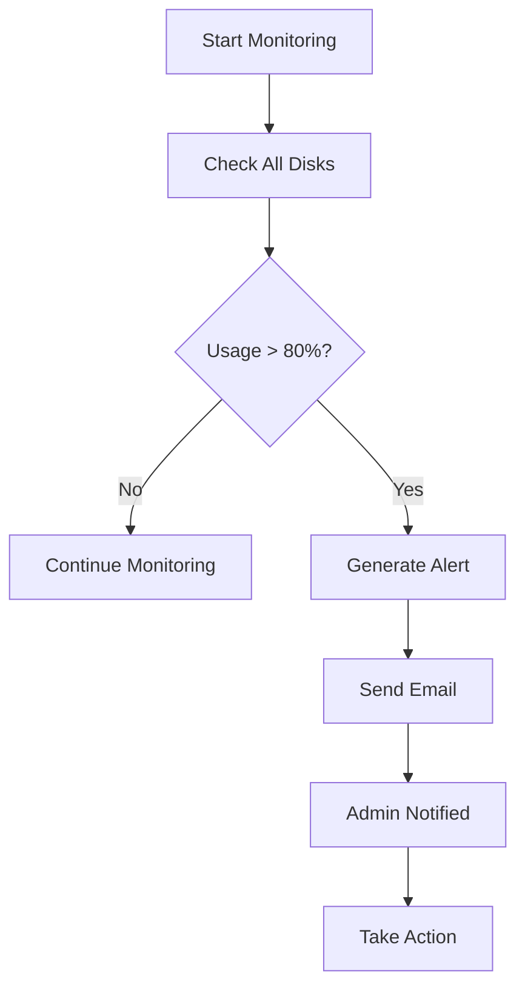

<h1 align="center">🚨 Disk Usage Alert Script</h1>

<h1 align="center" style="font-weight:bold;">
  📊 Linux Disk Usage Monitoring & Alert System
</h1>

<div align="center">
  
</div>

<div align="center">
  <br />
  
  
  
  
  
</div>

---

## 📋 Project Overview
A lightweight, efficient Bash script that monitors disk usage and sends email alerts when any filesystem exceeds 80% capacity. Perfect for DevOps engineers and system administrators to prevent disk space crises.

### ⚡ Key Features
* **Real-time Monitoring:** Continuously checks disk usage across all mounted filesystems
* **Smart Threshold Detection:** Alerts only when usage exceeds 80% (configurable)
* **Email Notifications:** Sends immediate alerts with mount point and usage details
* **Cron-Ready:** Easy to schedule for automated monitoring
* **Minimal Dependencies:** Uses standard Unix tools

---

## 👤 Author
**Jeyamurugan Nadar** *Aspiring DevOps & Cloud Engineer*

<p align="left">
  <a href="https://github.com/nadarmurugan" target="_blank">
    
  </a>
  <a href="https://linkedin.com/in/murugannadar/" target="_blank">
    
  </a>
  <a href="mailto:murugannadar077@gmail.com">
    
  </a>
</p>

---

## 🎯 Why This Script?

<div align="center">
  
</div>

### The Problem
Disk space issues are among the most common causes of system failures. Without monitoring, you only discover the problem when it's too late - applications crash, databases stop, and services fail.

### The Solution
This script provides **proactive monitoring** that alerts you **before** critical thresholds are reached, giving you time to take action.

---

## 📊 Monitoring Flow



---

## 🚀 Quick Start

### **1. Download the Script**
```bash
wget https://raw.githubusercontent.com/nadarmurugan/disk-alert/main/disk_alert.sh
chmod +x disk_alert.sh
```

### **2. Install Required Packages (One-Time Setup)**

**For Ubuntu/Debian:**
```bash
sudo apt update
sudo apt install mailutils -y
```

**For CentOS/RHEL:**
```bash
sudo yum install mailx -y
```

### **3. Configure Email**
Edit the script to add your email address:
```bash
nano disk_alert.sh
```
Change `yourmail@example.com` to your actual email address.

### **4. Test the Script**
```bash
./disk_alert.sh
```

---

## 📜 The Complete Script

```bash
#!/bin/bash
# Disk Usage Alert Script
# Monitors disk usage and sends email alerts when usage exceeds 80%
# Author: Jeyamurugan Nadar

# Disk monitoring command with awk filtering
df -h | awk '$5+0 > 80 {print "Disk Alert 🚨\nMount:", $6, "\nUsage:", $5}' \
| mail -s "Disk Usage Alert" murugannadar077@gmail.com
```

---

## 🧠 Interview Ready Statement

> **Memorize This:** "I use a Bash script with `df`, `awk`, and `mail` to send disk usage alerts when any filesystem exceeds 80% capacity."

---

## ⚙️ How It Works - Line by Line

### **1. Shebang Declaration**
```bash
#!/bin/bash
```
- Specifies Bash as the script interpreter
- Ensures compatibility across different Linux systems

### **2. Disk Usage Check**
```bash
df -h
```
- `df` - Disk Filesystem command
- `-h` - Human-readable format (GB, MB instead of blocks)

### **3. AWK Filtering Logic**
```bash
awk '$5+0 > 80 {print "Disk Alert 🚨\nMount:", $6, "\nUsage:", $5}'
```
- `$5+0` - Converts percentage string to number (removes % sign)
- `> 80` - Checks if usage exceeds 80%
- `$6` - Mount point (6th column)
- `$5` - Usage percentage (5th column)
- Only processes lines where usage > 80%

### **4. Email Pipeline**
```bash
| mail -s "Disk Usage Alert" murugannadar077@gmail.com
```
- `|` - Pipes filtered output to mail command
- `-s` - Sets email subject
- Sends alert to specified email address

---

## 🔧 Automation with Cron

### **Schedule Monitoring Every 5 Minutes**
```bash
crontab -e
```
Add this line:
```bash
*/5 * * * * /path/to/disk_alert.sh
```

### **Other Useful Cron Schedules**
```bash
# Every hour
0 * * * * /path/to/disk_alert.sh

# Every 30 minutes
*/30 * * * * /path/to/disk_alert.sh

# Every day at 9 AM
0 9 * * * /path/to/disk_alert.sh

# Every Monday at 8 AM
0 8 * * 1 /path/to/disk_alert.sh
```

---

## 📊 Understanding df Output

The `df -h` command outputs:
```
Filesystem      Size  Used Avail Use% Mounted on
/dev/sda1        20G   15G  3.9G  79% /
/dev/sdb1       100G   85G   10G  90% /data
```

| Column | Meaning | Script Usage |
|--------|---------|--------------|
| Column 1 | Filesystem device | Not used |
| Column 2 | Total size | Not used |
| Column 3 | Space used | Not used |
| Column 4 | Available space | Not used |
| **Column 5** | **Usage percentage** | **Alert trigger** |
| **Column 6** | **Mount point** | **Alert message** |

---

## 🎨 Customization Options

### **Change Alert Threshold**
Modify the number in the awk command:
```bash
# Current: Alert at 80%
awk '$5+0 > 80

# Alert at 90% (more aggressive)
awk '$5+0 > 90

# Alert at 70% (more conservative)
awk '$5+0 > 70
```

### **Customize Email Subject**
```bash
mail -s "🚨 CRITICAL: High Disk Usage Detected" murugannadar077@gmail.com
```

### **Add Server Hostname to Alert**
```bash
df -h | awk -v host="$(hostname)" '$5+0 > 80 {print "Disk Alert from: " host "\nMount:", $6, "\nUsage:", $5}' \
| mail -s "Disk Alert from $(hostname)" murugannadar077@gmail.com
```

### **Add Timestamp to Alerts**
```bash
df -h | awk -v date="$(date)" '$5+0 > 80 {print "Alert Time: " date "\nDisk Alert 🚨\nMount:", $6, "\nUsage:", $5}' \
| mail -s "Disk Usage Alert - $(date)" murugannadar077@gmail.com
```

---

## 🐧 System Requirements

| Component | Requirement | Check Command |
|-----------|-------------|---------------|
| OS | Linux/Unix | `uname -a` |
| Bash | Version 4+ | `bash --version` |
| Mail Utility | mailutils or mailx | `which mail` |
| Disk Space | Any | `df -h` |

---

## 🔍 Troubleshooting Guide

### **Common Issues & Solutions**

| Problem | Symptom | Solution |
|---------|---------|----------|
| Mail not sent | No email received | Check mail service: `sudo systemctl status postfix` |
| Permission denied | Script won't run | `chmod +x disk_alert.sh` |
| Command not found | mail: command not found | Install mailutils: `sudo apt install mailutils` |
| No output | Script runs but no alert | Check disk usage: maybe all disks are below 80% |
| Cron not working | Script doesn't run automatically | Check cron logs: `sudo grep CRON /var/log/syslog` |

### **Debug Mode**
Add echo statements to debug:
```bash
#!/bin/bash
echo "Starting disk check at $(date)" > /tmp/disk_check.log
df -h >> /tmp/disk_check.log
df -h | awk '$5+0 > 80 {print "Disk Alert 🚨\nMount:", $6, "\nUsage:", $5}' \
| mail -s "Disk Usage Alert" murugannadar077@gmail.com
echo "Check completed at $(date)" >> /tmp/disk_check.log
```

---

## 🏗️ Production Deployment

### **For Multiple Servers**
1. Place script in `/usr/local/bin/`
2. Create configuration file:
```bash
sudo mkdir -p /etc/disk-alert
sudo nano /etc/disk-alert/config
```
Add:
```
ALERT_EMAIL="murugannadar077@gmail.com"
THRESHOLD="80"
```

3. Update script to read config:
```bash
#!/bin/bash
source /etc/disk-alert/config
df -h | awk -v th="$THRESHOLD" '$5+0 > th {print "Disk Alert 🚨\nMount:", $6, "\nUsage:", $5}' \
| mail -s "Disk Usage Alert" "$ALERT_EMAIL"
```

### **For Docker Containers**
```dockerfile
# Add to Dockerfile
RUN apt-get update && apt-get install -y mailutils
COPY disk_alert.sh /usr/local/bin/
RUN chmod +x /usr/local/bin/disk_alert.sh
```

---

## 📈 Monitoring Dashboard Concept

While this script sends email alerts, you can extend it for dashboard integration:

```bash
#!/bin/bash
# Extended version with logging
LOG_FILE="/var/log/disk_monitor.log"
ALERT_FILE="/var/log/disk_alerts.log"

# Log all disk usage
echo "=== Disk Check $(date) ===" >> "$LOG_FILE"
df -h >> "$LOG_FILE"

# Check and alert
df -h | awk '$5+0 > 80 {
    print "ALERT: " $6 " at " $5 " on " strftime("%Y-%m-%d %H:%M:%S")
    print "Disk Alert 🚨\nMount:", $6, "\nUsage:", $5
}' | tee -a "$ALERT_FILE" | mail -s "Disk Usage Alert" murugannadar077@gmail.com
```

---

## 🎯 DevOps Integration

### **With Slack/Teams**
```bash
#!/bin/bash
# Send to Slack instead of email
WEBHOOK_URL="https://hooks.slack.com/services/..."

df -h | awk '$5+0 > 80 {
    printf "{\"text\":\"🚨 Disk Alert\\nMount: %s\\nUsage: %s\"}", $6, $5
}' | curl -X POST -H 'Content-type: application/json' --data @- "$WEBHOOK_URL"
```

### **With Cloud Monitoring**
```bash
# AWS CloudWatch Metrics
aws cloudwatch put-metric-data \
    --namespace "DiskUsage" \
    --metric-name "UsagePercent" \
    --dimensions MountPoint=$6 \
    --value $5 \
    --unit Percent
```

---

## 📚 Learning Resources

### **Commands Used**
- `df` - [Manual Page](https://man7.org/linux/man-pages/man1/df.1.html)
- `awk` - [GNU Awk Guide](https://www.gnu.org/software/gawk/manual/gawk.html)
- `mail` - [Mail Command](https://linux.die.net/man/1/mail)
- `cron` - [Cron Guide](https://man7.org/linux/man-pages/man5/crontab.5.html)

### **Related Concepts**
- Linux Filesystems
- System Monitoring
- Alerting Systems
- DevOps Automation
- Shell Scripting Best Practices

---

## 🤝 Contributing

Want to improve this script?
1. Fork the repository
2. Create a feature branch
3. Make your improvements
4. Submit a pull request

**Suggested Improvements:**
- Add support for multiple email recipients
- Implement different thresholds for different mount points
- Add SMS alert integration
- Create webhook support

---

## ⚖️ License

MIT License - Free to use, modify, and distribute. Attribution appreciated.

---

## 🌟 Support

If this script helps you:
- ⭐ Star the GitHub repository
- 🔗 Share with your colleagues
- 🐛 Report any issues
- 💡 Suggest new features

---

## 📞 Contact & Support

**Jeyamurugan Nadar**  
*Aspiring DevOps & Cloud Engineer*

<p align="left">
  <a href="https://github.com/nadarmurugan" target="_blank">
    
  </a>
  <a href="https://linkedin.com/in/murugannadar/" target="_blank">
    
  </a>
  <a href="mailto:murugannadar077@gmail.com">
    
  </a>
</p>

<div align="center">
  
</div>

---

## 🚀 Quick Reference Card

```bash
# One-liner for quick setup
wget -O disk_alert.sh https://bit.ly/disk-alert-script && chmod +x disk_alert.sh && sudo apt install mailutils -y && nano disk_alert.sh
```

**Remember:** Replace `murugannadar077@gmail.com` with your email before running!

---

*Last Updated: $(date)*  
*Happy Monitoring! 🎯*
